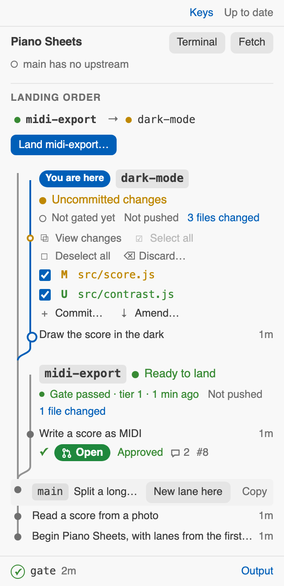

# LaneKit

**Work on several things at once in one repository, each in a lane of its own.**

A lane is a second checkout of your repository, in a folder beside it, on its own branch, with
its own port and its own copy of whatever else a running app needs: its `.env`, its database,
its uploads. Two features, or two AI agents, can be in flight side by side without sharing a
process, a file or a database row, and each lands back on `main` only once its tests pass.

<picture>
  <source media="(prefers-color-scheme: dark)" srcset="docs/images/lanes-dark.png">
  
</picture>

<sub>`lane web`: every lane of every repository on one page, each on a line of its own that
curves into main where it started, as Sapling's Interactive Smartlog draws a stack. A lane's
buttons show when the pointer is on it, as here on midi-export.</sub>

## The idea, in one picture

Each lane is a folder next to your repository. It is a real checkout (a git worktree), so you
can open it in an editor, run its server and its tests, while another lane does the same:

```
~/code/
├── piano-sheets/                 the main checkout, on main           port 8300
├── piano-sheets-midi-export/     a lane: branch midi-export           port 8301
└── piano-sheets-dark-mode/       a lane: branch dark-mode             port 8302
```

Every lane starts from `main`, and comes back to it with a merge commit of its own:

<picture>
  <source media="(prefers-color-scheme: dark)" srcset="docs/images/lanes-graph-dark.svg">
  
</picture>

## The loop

| | you run | what happens |
|---|---|---|
| **1. Start** | `./piano-sheets lane new midi-export` | a folder beside the repository, a branch, the next free port, and the lane's own `.env` |
| **2. Work** | `cd ../piano-sheets-midi-export` | edit, run, commit; nothing here touches `main` or any other lane |
| **3. Gate** | `./piano-sheets gate`, in the lane | rebases onto `main`, runs the tests the change earns, and records the result against the commit. It never merges |
| **4. Land** | `./piano-sheets lane land midi-export`, in `main` | merges with `--no-ff` once the gate is green, stops the lane's server, removes its folder, keeps its branch |

`./piano-sheets` is the project's shim: a small script, named after the project, that finds
lanekit on the machine and hands over. What each step prints, from a real run:

<details>
<summary><b>1.</b> <code>lane new</code> makes the lane</summary>

```
$ ./piano-sheets lane new midi-export
[lane] creating piano-sheets-midi-export on a new branch "midi-export" from main
HEAD is now at 4b69b8e Split a long score into pages
[lane] copied 1 gitignored path the checkout needs but git does not carry
[lane] this lane serves on 8301

────────────────────────────────────────────────────────────────
  lane "midi-export" ready
────────────────────────────────────────────────────────────────

  cd ~/code/piano-sheets-midi-export

  port     8301
  branch   midi-export (from main)
```
</details>

<details>
<summary><b>2.</b> <code>lane list</code> and <code>lane queue</code> say what is in flight, and what should land first</summary>

```
$ ./piano-sheets lane list

  LANE         PORT  SERVER
  main         —                the integration branch
  dark-mode    8302  ○ down 1 ahead
  midi-export  8301  ○ down 1 ahead

$ ./piano-sheets lane queue

  LANE         TIER  VERDICT
  dark-mode    1     commit first  server or tooling only
  midi-export  1     land now  server or tooling only
```

The queue asks git to merge every pair of lanes in memory, so it can say which would collide
before either lands, and in which order to land them so no gate has to run twice.
</details>

<details>
<summary><b>3.</b> <code>gate</code> checks the lane as it would merge</summary>

```
$ ./piano-sheets gate
[gate   0s] already on top of main
[gate   0s] 0 generated artifacts checked
[gate   0s] 1 file changed — server or tooling only
[gate   0s] tier 1: the check script
[gate   0s] running ./check…
  check: nothing is checked yet. Put this project's tests in ./check.

────────────────────────────────────────────────────────────────────
  READY  ·  midi-export  ·  tier 1 green on a5aacd3061  ·  0s
────────────────────────────────────────────────────────────────────

  Nothing has been merged. From a checkout of main:
    git merge --no-ff midi-export
```
</details>

<details>
<summary><b>4.</b> <code>lane land</code> merges it and clears it away</summary>

```
$ ./piano-sheets lane land midi-export
[lane] merging midi-export into main at ~/code/piano-sheets
[lane] merged — main is at 84e06c5
[lane] removed midi-export — branch "midi-export" kept

────────────────────────────────────────────────────────────────
  LANDED  ·  midi-export  ·  main at 84e06c5
────────────────────────────────────────────────────────────────
```

`land` refuses a lane whose last green gate is not about the commit it would merge, one that
should land after another, and a `main` with uncommitted changes.
</details>

## Getting started

You need git 2.38 or newer and Node 18 or newer, on macOS or Linux. lanekit lives on the
machine, not in your repository: it has no dependencies, and a Python, Go or Swift project
does not grow a `node_modules` to use it.

```
git clone https://github.com/Oerba-Labs/lanekit.git ~/.lanekit
```

### In a repository you already have: let your agent do it

In Claude Code, OpenCode or any agent that can run commands, from the repository, say:

> Install lanekit in this repository by following
> https://github.com/Oerba-Labs/lanekit/blob/main/INSTALL.md

[INSTALL.md](INSTALL.md) is written for the agent. It writes the files that are the same for
every project with `adopt`, reads your repository for the rest (how the app picks its port,
what a lane must have its own copy of, what the tests are), makes a trial lane to prove it,
and tells you what it decided. To do it yourself, run `node ~/.lanekit/bin/adopt.mjs` in the
repository and follow the same document.

### A new project, with lanes from its first commit

```
node ~/.lanekit/bin/init.mjs "Piano Sheets"
cd piano-sheets
./piano-sheets lane new first-idea
```

`init` writes the config, the shim, a `check` script for the tests, a `.gitignore` and a
README, and makes the first commit. Its port window sits above any other project beside it.

### What your repository gains

| file | what it is |
|---|---|
| `lane.config.json` | what a lane of this project owns and borrows: [the config](#the-config) |
| `./<project>` | the shim, the one command everything goes through |
| `./check` | what the gate runs: put the project's tests in it |
| `.claude/commands/`, `.opencode/commands/` | `/lane` and `/land` for Claude Code and OpenCode |
| `.claude/settings.json` hooks, `.opencode/plugins/lanekit.js` | each agent saying which lane it works in and what it is doing, for the page and the editor |

## Working with an agent

`/lane <what the work is>` starts a lane and moves the agent into it; `/land` gates the lane,
reports honestly, and asks before merging. They are committed with the repository, so they
exist in every checkout, every lane and every agent's sandbox. Two agents given one lane each
cannot overwrite each other's files, restart each other's servers or migrate each other's
database, and the queue says which should land first.

## See every lane at once

```
./piano-sheets lane web              # this repository, on http://127.0.0.1:13338
node ~/.lanekit/dev/lane.mjs web --scan ~/code
```

The page in the picture above, for every repository in a folder:

- **More than one repository** brings a switcher along the top: *All*, then each repository with the
  number of lanes in it, and a dot on one not shown while something runs there. Choosing one shows it
  alone and gives the page its name for a title (*api · LaneKit*). The address keeps the choice
  (`?repo=api`), so a browser tab can stay open on each; `[` and `]` step through them, *All* among
  them. A Cmd- or Ctrl-click on one, or the ↗ beside its **Fetch**, opens it in a tab of its own.
- **Each repository** opens with its **landing order**, grouped by what each lane needs: *Ready*,
  *Needs a gate*, *Commit first*, *Waiting* (each with the lanes it waits for: "dark-mode after
  midi-export"), *Rebase first*, *Part-way* (a rebase not finished), and *Quiet*. An order only holds
  between lanes that change the same files, so it is said only there, the costlier first; two such
  lanes are joined by a bracket in the margin. **Land next** lands the first ready one, after a
  check. A lane with nothing in it, or one set aside, is not in it.
- **A lane nobody has touched for a while is *quiet***: two weeks, or `lane.staleAfterDays` in its
  config, since its newest commit, its newest uncommitted change, or (with neither) its making. It
  says "Quiet for 4 weeks" first among its facts, and moves to the end of the landing order.
- **A lane not being worked on** can be **set aside**: out of the landing order and the log, listed
  apart under *Set aside* with **Bring back**, and nothing removed (it is kept in the clone's own git
  settings). Or **dropped**, after a check: what serves on its port stops and its folder goes, and its
  branch is kept, with the page saying whether origin has a copy or the branch here is the only one.
  A lane with uncommitted work is not dropped; commit or discard it first. `lane new <name>
  --existing` brings a dropped lane back from its branch; deleting the branch is a step of its own.
- **Each lane** is drawn as Interactive Smartlog draws a stack: its name as a tag, its state, its
  uncommitted files, and its commits as dots on a line of its own, which curves into main's line at
  the commit it started from. A commit is its words and its age (*22m*, *3d*); its hash is in its
  tooltip. Under the name, quietly: its last gate, whether it is pushed, its pull request when `gh`
  is signed in, and what serves on its port while anything does. While a press runs in it, it says
  so live: *Gating · running the tests… · 12 s*. A failed gate shows the failing step and its last
  lines, kept with the run, so it is still there tomorrow.
- **A commit chosen opens its details beside the log**, as Interactive Smartlog's right-hand side
  does: its whole message, its lane, hash, author and age, the files it changed (each opens its
  difference in the editor), and what can be done with it: **Goto**, **View changes**, **New lane
  here**, **Copy hash**, and on a lane's newest commit **Edit message** and **Uncommit**. In the
  side bar the details open under the row instead. A double click opens a commit's changes.
- **A commit's commands sit beside it**, after its words and its age, as ISL sets them, when the
  pointer is on it: **Goto** and **Uncommit** on a lane's newest, and a new lane from it and its
  hash to the clipboard as icons. Words longer than a line's worth are clipped; the whole of them
  is in the tooltip and the details. Each command carries an icon of its own.
- **The command bar along the bottom** says what is running, with its step and a clock, how the
  last command went (✓ or ✗, as you would type it), and what waits its turn: a press made while
  its repository is busy joins a line, is checked again when its turn comes, and can be cancelled
  with its ×. The output opens with a click, and by itself when something you pressed fails.
- **What a press will do is drawn at once**, before it has: a commit appears in its lane, dashed,
  as its files leave the list; a rebased lane moves above its new commit; a new lane appears where
  it will start. The next reading after it ends says what really happened.
- **Its buttons show when the pointer or the keyboard is on it**, the way Sapling's Interactive
  Smartlog does, so a page of lanes reads calmly until you reach for one. They are lane's own
  commands, run as a terminal would run them, with their output underneath: **Gate**, **Land**,
  **Sweep**, **Rebase** (a lane that is behind), **Push** (one with commits origin lacks), **Pull
  request** (one pushed without one), **Pull** (main behind origin) and **Fetch**. Land and Sweep
  check first with `--dry-run` and ask; a push that would replace origin's copy of a rebased branch
  asks too. A rebase that conflicts stops with the files named, and waits for **Continue** or
  **Abort**.
- **A new lane starts from a commit.** Point at any commit, of main or of a lane, choose **New lane
  here**, and type its name in that row: the lane starts from that commit, on top of it.
- **A lane can be dragged onto a commit of main** to rebase it there: while it is dragged, a ghost
  of it is drawn where it would start, and the drop asks first. A lane with uncommitted work, or
  in the middle of something, stays where it is. **Back onto an older commit** is allowed, and the
  question says so: the lane keeps its own commits and leaves main's newer ones out from under it,
  a place to work from (to see whether a newer commit of main broke it, or to keep going while main
  is broken) but never to land from, since the gate moves a lane onto main's newest before it tests.
  If its commits need what it leaves behind, the rebase stops on the files that conflict, and
  **Abort** puts it back exactly; a pushed lane moved back asks before its next push replaces
  origin's copy.
- **What is uncommitted is a node of its own on the lane's line**: each file ticked, in the colour
  of what happened to it (M, A, D, U), with **Select all**, **Deselect all** and **Discard…** above
  (Discard asks, and throws away only the ticked files), and **+ Commit…** and **↓ Amend** under
  them, which open the message form for the ticked files: **Commit** or **Amend**, a title, and a
  description. Amend and Edit message start from the newest commit's own words.
- **A rebase stopped on a conflict** lists its files, each with **✓ Resolved**, which LaneKit
  refuses while a conflict marker is left in the file; then **Continue** carries on.
- **A pull request has badges** under its lane's newest commit: its checks (✓, ✗ or •), Open,
  Draft, Merged or Closed, its review, its comments, and its number, each a link to it.
- **Origin's main** wears a tag where it is; when origin has commits main lacks, a dashed row above
  main's newest says how many, with **Pull**. Main's line ends dashed where its history goes on.
- **It stays current by itself:** while it is open, each repository is fetched every five minutes,
  so "behind origin" is true without anybody asking; nothing is pulled or merged by it.
- **The keyboard:** `j` and `k` move between lanes, `Enter` opens one, `g` gates, `l` lands, `r`
  rebases, `p` pushes, `c` commits, `u` uncommits, `o` goes to it, `t` opens a terminal in it and `a` an agent (in
  the editor), `f` fetches, `n` names a new lane from the lane's
  newest commit (or main's), `[` and `]` show the repository before or the next, `Esc` closes the
  details, `?` lists them; in the message form,
  `⌘ Enter` commits.

It listens on the loopback only. `--ssh-host <host>` adds a link that opens a lane in VS Code over
Remote-SSH, and `--browser-editor <prefix>` one to a browser editor.

## In your editor

`vscode/` is LaneKit's extension for VS Code and for browser editors such as code-server. The
LaneKit icon in the activity bar opens the same page in an **editor tab** of its own, the way
Sapling's Interactive Smartlog sits in the editor, and closes the side bar again; set
`lanekit.opensIn` to `sideBar` to keep it in the side bar instead, laid out for a narrow column, as
in the picture. There its clicks drive the editor:

<picture>
  <source media="(prefers-color-scheme: dark)" srcset="docs/images/lanekit-sidebar-dark.png">
  
</picture>

- a commit opens as the diffs of what it changed; a lane's **Changes** opens everything it
  holds that the integration branch does not, committed or not, against its files as they are,
  so you can edit them in the diff; an uncommitted file opens its own difference;
- the lane the file in front of you is in says **You are here**;
- **a repository in a tab of its own**: each tab is titled with the repository its switcher shows
  (*api · LaneKit*), and a Cmd- or middle-click on one in the switcher, the ↗ beside its **Fetch**, the
  status bar's menu, or **LaneKit: Show a Repository in a Tab of Its Own…** opens one for that
  repository alone, or brings forward the one already open. A lane asked for from the status bar
  goes to the tab showing its repository, and each tab comes back on its repository after a reload;
- in the side bar, where there is no room for a toolbar, the pointer on a lane shows the next
  thing to do and a **⋯** that opens the rest;
- **Goto** moves you to a lane, as Interactive Smartlog's Goto moves your working copy: each file you
  have open from another checkout reopens from that lane, where it was, and the Explorer shows its
  folder; a file with unsaved changes stays where it is, and nothing on disk changes. The terminal
  you were using follows: a shell waiting at its prompt in another checkout is sent `cd` to the
  same folder in the lane; one running something (a server, an agent) is never typed into, and the
  terminal you last used in the lane comes forward instead, or one opens there. It is on the
  lane's toolbar, on its newest commit (and main's) under the pointer, in the details, and `o`;
- **Terminal** opens a terminal in a lane, named for it and in a colour of its own that every
  terminal of that lane shares, or brings back the one it opened before while it waits at its
  prompt. **Agent** starts Claude Code or OpenCode in the lane, in a terminal named for both
  (`midi-export · Claude`), so the terminal list says which agent works where;
- **the agents at work** are drawn on the lane each works in, Claude Code's and OpenCode's alike:
  **Thinking**, **Running** a tool, **Needs you** (a permission or a question, and what it asks to
  use), **Done** or **Failed**, since when; a click on one brings forward its terminal. One coming
  to need you is said in a notification with **Show**, unless its terminal is the one in front, and
  the status bar counts the agents and those waiting on you, a click listing them all. Each agent
  says this itself, through the hooks and the plugin `adopt` writes, into the main checkout's
  `.lanekit/agents/`: its state, the name of its tool, its folder and its process, never what the
  tool was given or what anybody said. An agent that ends, or dies, drops off;
- a rebase that stopped on a conflict opens its files (**Conflicts**), where each conflict can be
  accepted one way, the other, or both; a file and line in a failed gate's output opens there;
- the status bar names the lane the file in front of you is in, and what it needs ("ready to
  land"); a click opens that lane's menu: Goto, Changes, Terminal, Start agent, Gate, Land, Rebase, Push, **New
  lane from here** (on top of this one), or the lane in a new window of its own;
- the palette's **LaneKit: …** commands act on the lane in front of you, with the page's own
  checks, and a press that ends while LaneKit is out of sight says how it ended;
- `lanekit.opensIn`, `tab` by default, says where the icon, the status bar's lane menu and a
  notification's **Show** open LaneKit: an editor tab, or `sideBar`;
- `lanekit.gateOnCommit`, off by default, gates a lane by itself when a commit lands in it.

No server and no port: the extension runs the page's service itself, reads git in a worker
thread so the editor never waits, tells every page open when anything changed, and finds
repositories in the folders the window has open, a lane's own folder included. It runs lanekit
from the checkout on the machine (`lanekit.path`, else the places the shim looks: `$LANEKIT`,
`/opt/lanekit`, `~/.lanekit`), so it and the `lane` commands are always one version. It stays
off in a folder the editor has not been told to trust, since it runs the repository's own
commands.

```
node ~/.lanekit/vscode/pack.mjs       # writes vscode/lanekit-<version>.vsix, no dependencies
code --install-extension ~/.lanekit/vscode/lanekit-0.12.0.vsix
```

<br clear="right">

## Commands

```
./<project> lane new <name>      start a lane: a folder, a branch, a port, its own state
./<project> lane list            what exists, each lane's port, and what is serving
./<project> lane queue [name]    which lane should land next, and which would collide
./<project> gate                 in a lane: is this branch ready to merge?
./<project> lane land <name>     in main: merge a lane whose gate is green, then sweep it
./<project> lane rebase <name>   replay a lane onto main as it is now; --continue or --abort after a conflict
./<project> lane push <name>     send a lane's branch to origin; --force-with-lease once it was rebased
./<project> lane pr <name>       open a pull request for a pushed lane, through gh
./<project> lane pull            fast-forward main to origin, as of the last fetch
./<project> lane commit <name>   commit what is uncommitted: -m <message>, --amend, --reword, -- <file>…
./<project> lane uncommit <name> take the newest commit back out, its changes left uncommitted
./<project> lane discard <name> -- <file>…   throw away what is uncommitted in those files
./<project> lane resolve <name> -- <file>…   mark conflicted files resolved, once no marker is left
./<project> lane aside <name>    set a lane aside: out of the landing order, nothing removed
./<project> lane resume <name>   bring a lane set aside back
./<project> lane drop <name>     remove a lane's folder and keep its branch; --dry-run says what it would do
./<project> lane sweep [name]    remove lanes whose branch has landed
./<project> lane web             a page of every lane (in your editor: LaneKit's side bar)
./<project> check                what the gate runs
```

`lane new` takes `--base <ref>` to start from something other than the integration branch,
`--existing` to make a lane of a branch that is there already (one dropped earlier),
`--install` to build the lane's own copies of what would otherwise be shared, `--no-seed` to
skip filling what it must own, and `--no-provision` to make the folder and stop. `gate` takes
`--fast` (tier 1 whatever the change earns; it says `UNDER-GATED` rather than `READY`),
`--tier <n>` and `--json`. `land` and `sweep` take `--dry-run`.

## The config

`lane.config.json`, at the root of the repository, holds everything that differs between
projects. A web app with a server, a SQLite database per lane and a slower build for changes
to its front end might say:

```json
{
  "name": "Piano Sheets",
  "slug": "piano-sheets",
  "integrationBranch": "main",
  "roots": { "server": "server", "app": "web" },
  "gate": {
    "sides": { "app": ["web/"] },
    "seam": ["server/api/", "web/src/api/"],
    "generated": [],
    "tiers": {
      "1": { "label": "the tests", "steps": [{ "what": "running ./check", "command": "{repo}/check", "args": [] }] },
      "2": { "label": "the tests and the web build", "steps": [
        { "what": "running ./check", "command": "{repo}/check", "args": [] },
        { "what": "building the web app", "command": "npm", "args": ["run", "build"], "cwd": "web" }
      ] }
    }
  },
  "lane": {
    "portBase": 8301,
    "portCeiling": 8399,
    "copyOnCreate": [".env"],
    "linkOnCreate": ["node_modules"],
    "env": { "file": ".env", "portKey": "PORT", "perLane": { "DATABASE_PATH": "{lane}/data/app.db" } },
    "makeDirs": ["{lane}/data"],
    "seed": [{ "what": "migrating the lane's database", "command": "npm", "args": ["run", "migrate"] }],
    "provision": [{ "what": "installing dependencies", "command": "npm", "args": ["ci"] }],
    "runHint": "npm run dev"
  }
}
```

| key | what it decides |
|---|---|
| `name`, `slug` | what is shown, and the form safe in a path: the shim and every lane folder are named from it |
| `integrationBranch` | what a lane starts from, and what "landed" means |
| `roots` | the project's directories, used as `{server}` and `{app}` in the gate's steps; refused if one names nothing |
| `gate.tiers` | what the gate runs. Tier 1 is every change; tier 2 is earned by a change to `gate.sides.app` or to `gate.seam`, the files one side shares with the other |
| `gate.generated` | committed files a generator owns: regenerated and compared, so a stale one is caught |
| `lane.portBase`, `portCeiling` | the window a lane's port comes from. A machine can take a share of it with `LANEKIT_PORTS="<slug>=<first>-<last>"`, which narrows it and never widens it |
| `lane.staleAfterDays` | optional: after how many days with nothing done in it a lane is called quiet; fourteen when left out |
| `lane.copyOnCreate` | files git ignores that a running checkout needs: copied into each lane, never shared |
| `lane.linkOnCreate` | big folders every lane can share, linked from the main checkout; `lane new --install` builds the lane's own and runs `lane.provision` |
| `lane.env` | the file a lane writes its port into (`portKey`), and values each lane must have its own of (`perLane`) |
| `lane.makeDirs` | folders the lane's values point at, made when it is |
| `lane.seed` | what fills what a lane owns, its database or its media: run on every `lane new` |
| `lane.runHint` | how to start the app, printed when a lane is made |

In any of these, `{lane}` is the lane's folder, `{main}` the main checkout, `{port}` the lane's
port and `{name}` its name; in a gate step, `{repo}` is the checkout being gated.
[INSTALL.md](INSTALL.md) says how to find each answer in a repository.

## Two decisions worth knowing

**Nothing is written down.** There is no registry of lanes. Git already knows which worktrees
exist, and each lane's environment file already records what it was given, so a lane is found
rather than remembered. A second copy would be right until somebody removed a worktree by hand.

**A port is free only if no lane claims it *and* nothing is serving on it.** A lane removed by
hand leaves its server running; a new lane handed that port would spend the afternoon talking
to a server running out of a folder that no longer exists. It answers, which is what makes it
expensive.

## Contributing

`node --test` runs the tests, on scratch repositories. lanekit is plain JavaScript with no
dependencies and no build step, and is kept that way.

## Licence

lanekit is released under the Apache License, Version 2.0 ([LICENSE](LICENSE)). Copyright 2026
Andrei Villasana.
