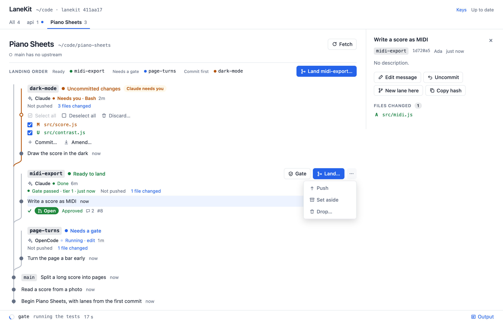
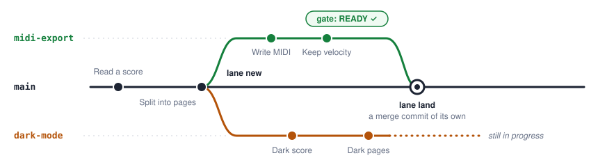

# lanekit

**Work on several things at once in one repository, each in a lane of its own.**

A lane is a second checkout of your repository, in a folder beside it, on its own branch, with
its own port and its own copy of whatever else a running app needs: its `.env`, its database,
its uploads. Two features, or two AI agents, can be in flight side by side without sharing a
process, a file or a database row, and each lands back on `main` only once its tests pass.

<picture>
  <source media="(prefers-color-scheme: dark)" srcset="docs/images/lanes-dark.png">
  
</picture>

<sub>`lane web`: every lane of every repository on one page, drawn above the commit it started
from, with what each needs next and the buttons that do it.</sub>

## The idea, in one picture

Each lane is a folder next to your repository. It is a real checkout (a git worktree), so you
can open it in an editor, run its server and its tests, while another lane does the same:

```
~/code/
├── piano-sheets/                 the main checkout, on main           port 8300
├── piano-sheets-midi-export/     a lane: branch midi-export           port 8301
└── piano-sheets-dark-mode/       a lane: branch dark-mode             port 8302
```

Every lane starts from `main`, and comes back to it with a merge commit of its own:

<picture>
  <source media="(prefers-color-scheme: dark)" srcset="docs/images/lanes-graph-dark.svg">
  
</picture>

## The loop

| | you run | what happens |
|---|---|---|
| **1. Start** | `./piano-sheets lane new midi-export` | a folder beside the repository, a branch, the next free port, and the lane's own `.env` |
| **2. Work** | `cd ../piano-sheets-midi-export` | edit, run, commit; nothing here touches `main` or any other lane |
| **3. Gate** | `./piano-sheets gate`, in the lane | rebases onto `main`, runs the tests the change earns, and records the result against the commit. It never merges |
| **4. Land** | `./piano-sheets lane land midi-export`, in `main` | merges with `--no-ff` once the gate is green, stops the lane's server, removes its folder, keeps its branch |

`./piano-sheets` is the project's shim: a small script, named after the project, that finds
lanekit on the machine and hands over. What each step prints, from a real run:

<details>
<summary><b>1.</b> <code>lane new</code> makes the lane</summary>

```
$ ./piano-sheets lane new midi-export
[lane] creating piano-sheets-midi-export on a new branch "midi-export" from main
HEAD is now at 4b69b8e Split a long score into pages
[lane] copied 1 gitignored path the checkout needs but git does not carry
[lane] this lane serves on 8301

────────────────────────────────────────────────────────────────
  lane "midi-export" ready
────────────────────────────────────────────────────────────────

  cd ~/code/piano-sheets-midi-export

  port     8301
  branch   midi-export (from main)
```
</details>

<details>
<summary><b>2.</b> <code>lane list</code> and <code>lane queue</code> say what is in flight, and what should land first</summary>

```
$ ./piano-sheets lane list

  LANE         PORT  SERVER
  main         —                the integration branch
  dark-mode    8302  ○ down 1 ahead
  midi-export  8301  ○ down 1 ahead

$ ./piano-sheets lane queue

  LANE         TIER  VERDICT
  dark-mode    1     commit first  server or tooling only
  midi-export  1     land now  server or tooling only
```

The queue asks git to merge every pair of lanes in memory, so it can say which would collide
before either lands, and in which order to land them so no gate has to run twice.
</details>

<details>
<summary><b>3.</b> <code>gate</code> checks the lane as it would merge</summary>

```
$ ./piano-sheets gate
[gate   0s] already on top of main
[gate   0s] 0 generated artifacts checked
[gate   0s] 1 file changed — server or tooling only
[gate   0s] tier 1: the check script
[gate   0s] running ./check…
  check: nothing is checked yet. Put this project's tests in ./check.

────────────────────────────────────────────────────────────────────
  READY  ·  midi-export  ·  tier 1 green on a5aacd3061  ·  0s
────────────────────────────────────────────────────────────────────

  Nothing has been merged. From a checkout of main:
    git merge --no-ff midi-export
```
</details>

<details>
<summary><b>4.</b> <code>lane land</code> merges it and clears it away</summary>

```
$ ./piano-sheets lane land midi-export
[lane] merging midi-export into main at ~/code/piano-sheets
[lane] merged — main is at 84e06c5
[lane] removed midi-export — branch "midi-export" kept

────────────────────────────────────────────────────────────────
  LANDED  ·  midi-export  ·  main at 84e06c5
────────────────────────────────────────────────────────────────
```

`land` refuses a lane whose last green gate is not about the commit it would merge, one that
should land after another, and a `main` with uncommitted changes.
</details>

## Getting started

You need git 2.38 or newer and Node 18 or newer, on macOS or Linux. lanekit lives on the
machine, not in your repository: it has no dependencies, and a Python, Go or Swift project
does not grow a `node_modules` to use it.

```
git clone https://github.com/Oerba-Labs/lanekit.git ~/.lanekit
```

### In a repository you already have: let your agent do it

In Claude Code, OpenCode or any agent that can run commands, from the repository, say:

> Install lanekit in this repository by following
> https://github.com/Oerba-Labs/lanekit/blob/main/INSTALL.md

[INSTALL.md](INSTALL.md) is written for the agent. It writes the files that are the same for
every project with `adopt`, reads your repository for the rest (how the app picks its port,
what a lane must have its own copy of, what the tests are), makes a trial lane to prove it,
and tells you what it decided. To do it yourself, run `node ~/.lanekit/bin/adopt.mjs` in the
repository and follow the same document.

### A new project, with lanes from its first commit

```
node ~/.lanekit/bin/init.mjs "Piano Sheets"
cd piano-sheets
./piano-sheets lane new first-idea
```

`init` writes the config, the shim, a `check` script for the tests, a `.gitignore` and a
README, and makes the first commit. Its port window sits above any other project beside it.

### What your repository gains

| file | what it is |
|---|---|
| `lane.config.json` | what a lane of this project owns and borrows: [the config](#the-config) |
| `./<project>` | the shim, the one command everything goes through |
| `./check` | what the gate runs: put the project's tests in it |
| `.claude/commands/`, `.opencode/commands/` | `/lane` and `/land` for Claude Code and OpenCode |

## Working with an agent

`/lane <what the work is>` starts a lane and moves the agent into it; `/land` gates the lane,
reports honestly, and asks before merging. They are committed with the repository, so they
exist in every checkout, every lane and every agent's sandbox. Two agents given one lane each
cannot overwrite each other's files, restart each other's servers or migrate each other's
database, and the queue says which should land first.

## See every lane at once

```
./piano-sheets lane web              # this repository, on http://127.0.0.1:13338
node ~/.lanekit/dev/lane.mjs web --scan ~/code
```

The page in the picture above, for every repository in a folder: each lane drawn above the
commit it started from, with its commits, what is uncommitted, its port and whether anything
serves on it, its last gate, the queue's verdict and what it collides with, and its pull
request when `gh` is signed in. Its buttons are the commands in the loop, run as a terminal
would run them, with their output underneath; Land and Sweep check first with `--dry-run` and
ask. It listens on the loopback only and never pushes. `--ssh-host <host>` adds a link that
opens a lane in VS Code over Remote-SSH, and `--browser-editor <prefix>` one to a browser
editor.

## Commands

```
./<project> lane new <name>      start a lane: a folder, a branch, a port, its own state
./<project> lane list            what exists, each lane's port, and what is serving
./<project> lane queue [name]    which lane should land next, and which would collide
./<project> gate                 in a lane: is this branch ready to merge?
./<project> lane land <name>     in main: merge a lane whose gate is green, then sweep it
./<project> lane sweep [name]    remove lanes whose branch has landed
./<project> lane web             a page of every lane
./<project> check                what the gate runs
```

`lane new` takes `--base <ref>` to start from something other than the integration branch,
`--install` to build the lane's own copies of what would otherwise be shared, `--no-seed` to
skip filling what it must own, and `--no-provision` to make the folder and stop. `gate` takes
`--fast` (tier 1 whatever the change earns; it says `UNDER-GATED` rather than `READY`),
`--tier <n>` and `--json`. `land` and `sweep` take `--dry-run`.

## The config

`lane.config.json`, at the root of the repository, holds everything that differs between
projects. A web app with a server, a SQLite database per lane and a slower build for changes
to its front end might say:

```json
{
  "name": "Piano Sheets",
  "slug": "piano-sheets",
  "integrationBranch": "main",
  "roots": { "server": "server", "app": "web" },
  "gate": {
    "sides": { "app": ["web/"] },
    "seam": ["server/api/", "web/src/api/"],
    "generated": [],
    "tiers": {
      "1": { "label": "the tests", "steps": [{ "what": "running ./check", "command": "{repo}/check", "args": [] }] },
      "2": { "label": "the tests and the web build", "steps": [
        { "what": "running ./check", "command": "{repo}/check", "args": [] },
        { "what": "building the web app", "command": "npm", "args": ["run", "build"], "cwd": "web" }
      ] }
    }
  },
  "lane": {
    "portBase": 8301,
    "portCeiling": 8399,
    "copyOnCreate": [".env"],
    "linkOnCreate": ["node_modules"],
    "env": { "file": ".env", "portKey": "PORT", "perLane": { "DATABASE_PATH": "{lane}/data/app.db" } },
    "makeDirs": ["{lane}/data"],
    "seed": [{ "what": "migrating the lane's database", "command": "npm", "args": ["run", "migrate"] }],
    "provision": [{ "what": "installing dependencies", "command": "npm", "args": ["ci"] }],
    "runHint": "npm run dev"
  }
}
```

| key | what it decides |
|---|---|
| `name`, `slug` | what is shown, and the form safe in a path: the shim and every lane folder are named from it |
| `integrationBranch` | what a lane starts from, and what "landed" means |
| `roots` | the project's directories, used as `{server}` and `{app}` in the gate's steps; refused if one names nothing |
| `gate.tiers` | what the gate runs. Tier 1 is every change; tier 2 is earned by a change to `gate.sides.app` or to `gate.seam`, the files one side shares with the other |
| `gate.generated` | committed files a generator owns: regenerated and compared, so a stale one is caught |
| `lane.portBase`, `portCeiling` | the window a lane's port comes from. A machine can take a share of it with `LANEKIT_PORTS="<slug>=<first>-<last>"`, which narrows it and never widens it |
| `lane.copyOnCreate` | files git ignores that a running checkout needs: copied into each lane, never shared |
| `lane.linkOnCreate` | big folders every lane can share, linked from the main checkout; `lane new --install` builds the lane's own and runs `lane.provision` |
| `lane.env` | the file a lane writes its port into (`portKey`), and values each lane must have its own of (`perLane`) |
| `lane.makeDirs` | folders the lane's values point at, made when it is |
| `lane.seed` | what fills what a lane owns, its database or its media: run on every `lane new` |
| `lane.runHint` | how to start the app, printed when a lane is made |

In any of these, `{lane}` is the lane's folder, `{main}` the main checkout, `{port}` the lane's
port and `{name}` its name; in a gate step, `{repo}` is the checkout being gated.
[INSTALL.md](INSTALL.md) says how to find each answer in a repository.

## Two decisions worth knowing

**Nothing is written down.** There is no registry of lanes. Git already knows which worktrees
exist, and each lane's environment file already records what it was given, so a lane is found
rather than remembered. A second copy would be right until somebody removed a worktree by hand.

**A port is free only if no lane claims it *and* nothing is serving on it.** A lane removed by
hand leaves its server running; a new lane handed that port would spend the afternoon talking
to a server running out of a folder that no longer exists. It answers, which is what makes it
expensive.

## Contributing

`node --test` runs the tests, on scratch repositories. lanekit is plain JavaScript with no
dependencies and no build step, and is kept that way.

## Licence

lanekit is released under the Apache License, Version 2.0 ([LICENSE](LICENSE)). Copyright 2026
Andrei Villasana.
